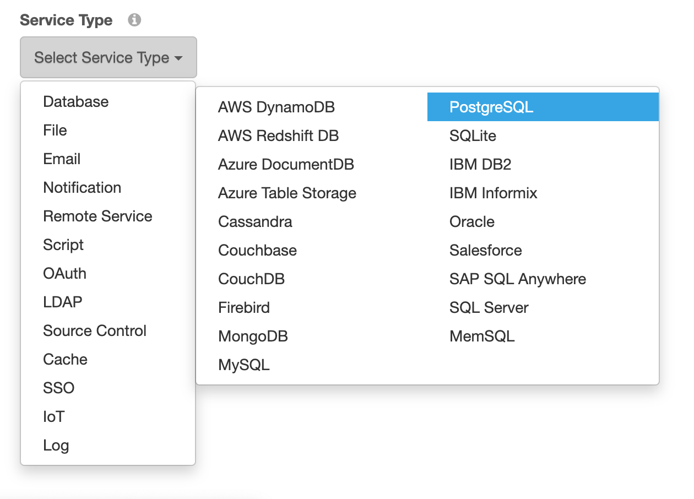
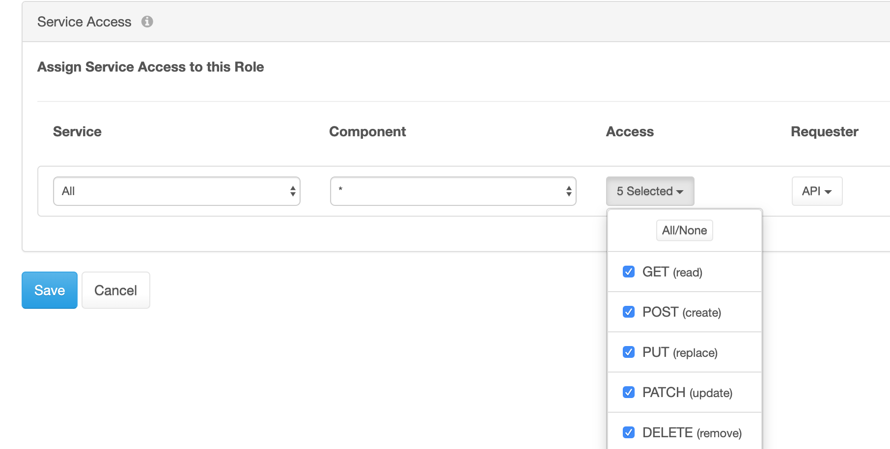
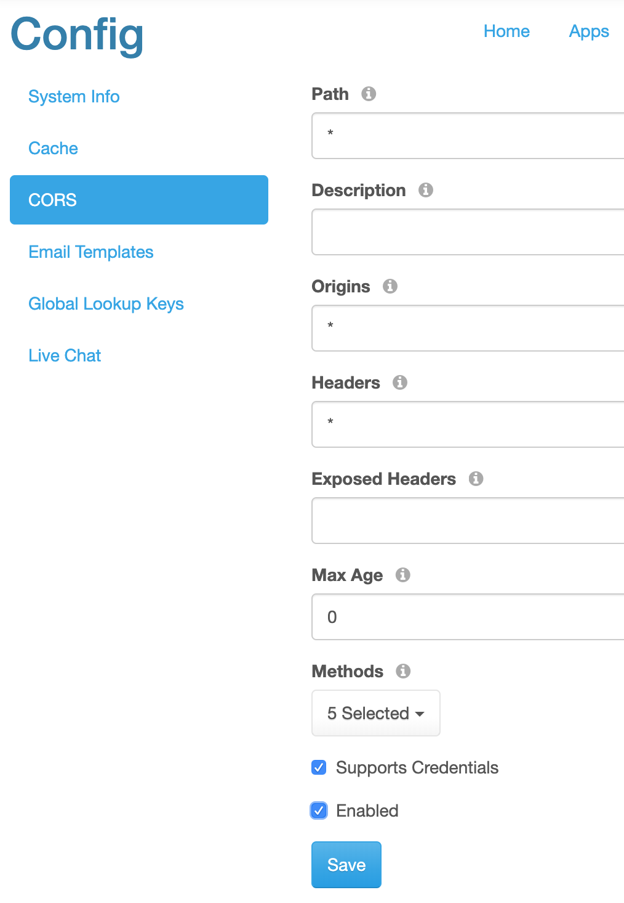

In this post I'll be going over how to install and configure DreamFactory and set it up so that your web app can be served from DreamFactory's built in Apache server. This post is essentially a walkthrough. I'll take you through setting things up in the admin console and provide a few commands to run in the terminal.

But first, what is DreamFactory? From their [wiki](http://wiki.dreamfactory.com/DreamFactory/Overview):

> DreamFactory is an open source REST API middleware platform that provides RESTful services for building mobile, web, and IoT applications.
> DreamFactory automatically generates a comprehensive, customizable, and secure REST API for backend data resources, including SQL, NoSQL, file storage, email, and push notifications. You can also securely proxy to any remote REST or SOAP service and run your own custom APIs with DreamFactory.
> Other important features include server-side scripting with V8 Javascript, Node.js, PHP, and Python, single sign-on, user management, LDAP / Active Directory / OAuth integration, role-based access control on tables and records, interactive API docs, and sample applications to quickly learn by example.

DreamFactory acts as middleware that sits between your front end and your database. It will automatically generate an API that you can communicate with to perform CRUD operations. You just build your front end to make calls to the API endpoints DreamFactory generates and DreamFactory will return JSON (or XML).

DreamFactory can also handle user signup and authentication and gives you security controls and custom scripting capabilities.

The easiest way to get DreamFactory up and running is to use docker. This docker-compose file from DreamFactory's [docker hub](https://hub.docker.com/r/dreamfactorysoftware/df-docker/) will get you going in no time.

```
version: '2'

services:
  mariadb:
    image: bitnami/mariadb:latest
    volumes:
      - mariadb_data:/bitnami
    environment:
      - ALLOW_EMPTY_PASSWORD=yes
  mongodb:
    image: 'bitnami/mongodb:latest'
    volumes:
      - 'mongodb_data:/bitnami'
  redis:
    image: 'bitnami/redis:latest'
    environment:
      - ALLOW_EMPTY_PASSWORD=yes
    volumes:
      - 'redis_data:/bitnami'
  dreamfactory:
    image: dreamfactorysoftware/df-docker:latest
    depends_on:
      - mariadb
      - mongodb
      - redis
    ports:
      - '80:80'
      - '443:443'
    volumes:
      - dreamfactory_data:/bitnami

volumes:
  mariadb_data:
    driver: local
  mongodb_data:
    driver: local
  redis_data:
    driver: local
  dreamfactory_data:
    driver: local
```

Like the linked documentation says, `docker-compose up -d` and you're off to the races. You may want to edit that ports line to something like `8080:80` if you're following along on your local machine.

Now you can reach the admin console in your browser by going to the IP address of wherever it is you're running DreamFactory, or localhost:8080 if you're running it locally and changed the port mapping in the docker-compose file. When you first load the admin console you'll be prompted to configure an admin user and set a password.

Once you're in the admin console you can start configuring things. I'll walk you through the crucial items.

##Connecting a database

To connect a database click on the "Services" tab and click "Create" then select the appropriate database type from dropdown menu.


As you can see, there are lots of databases and other service types to choose from. Configuration for your database connection will depend on your own specific database.

Once you've added your database connection info you can test it by going to the "Schema" tab and selecting your new database service. Click the refresh icon. If everything went well you'll be greeted with a success message.

##Create a user role and enable user registration

Next you'll need to setup a role for your users.
Click the "Roles" tab and click "Create". Give your role a name and description and click the "Access" tab.
Click the plus sign and you can set access rules. Click save when finished.


If your app will require user registration then click the "Services" tab and click on the user service. Click the "Config" tab and use the role you created for "Default Open Reg Role". If you're not yet ready to configure an email service for user registration then set the "Open Reg Email Service" to blank. Click save when finished.

##Create the "App" (and optionally enable CORS)

Click the "Apps" tab and click the "Create" button and fill out the items. Select the role you just created for the Default Role. Notice that your API key has been created and is displayed on this page. You can also access it from the "Services" tab.

When you are developing your front end you may want to work locally and communicate with DreamFactory using CORS. If that is the case you can select "No Storage Required" for your App Location.

Check the "Active" box and click save.

To enable CORS, click on the "Config" tab and click "CORS" from the sidebar. Configure this in whatever way suits your needs. To make access wide open set Path, Origins, and Headers to \*.
Be sure to select the HTTP verbs you want allowed, and to check "Supports Credentials" and "Enabled". Click save when finished.



##Add your front end files to DreamFactory and allow access

Once you've completed your local development you might want to set things up so that your website is served up from DreamFactory's built in Apache server.

First, lets create a directory inside of DreamFactory at the correct location. Access the shell of your DreamFactory container with `docker exec -it <container name> /bin/bash` run `docker ps` if you need to find your container's name.

Now create a new directory: `mkdir /opt/bitnami/dreamfactory/storage/app/<your directory>`.

Exit DreamFactory's shell and use docker cp to copy your files into place.

`docker cp ./<local directory>/. <container name>:/opt/bitnami/dreamfactory/storage/app/<DF directory>`

##Set the new app location and allow access

Back in the admin console, click on the "Services" tab and then click the "files" service. Click the "Config" tab and add the name of the directory created in the previous section. Enter the correct value for the root folder. If you followed my example it will be "app". Click save.

Next click the "Apps" tab and click on your app. For App Location select "On a provisioned file storage service". Set the Storage Service to "Local File Storage" and set the Storage Folder to the directory you created in the previous section. Set the launch path to the correct file in that directory if it is something other than the default index.html.

Save, and you can now launch your app from the URL displayed at the bottom of the page, or from the play button next to your app's name under the "Apps" tab.
