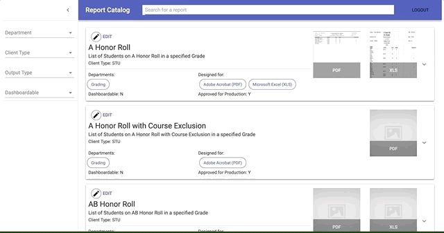
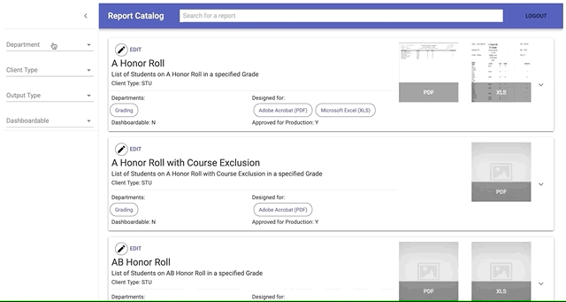
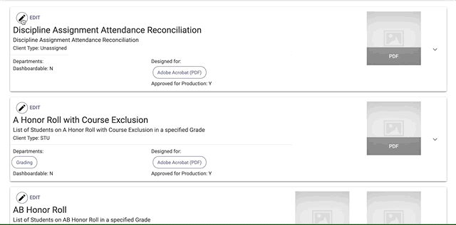
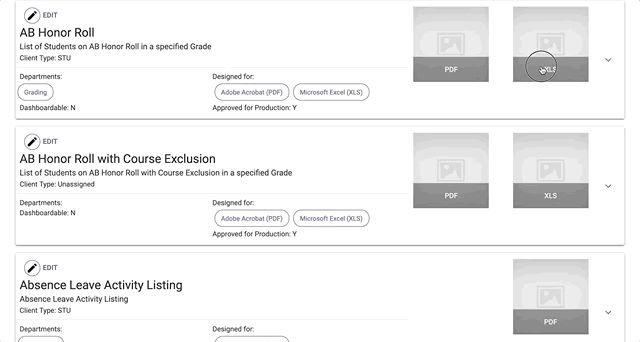

The Report Catalog is an internal web app I developed at my current job, so I won't be able provide a link or share any code. I can, however, describe the project and provide some screenshots.

##Introducing the Problem

We have a lot of reports where I work, and reporting is a big part of our main product. It's good to have a lot of reports. We can get useful data into the right hands, and our users are satisfied that they have the reports that they need. But the downside of having a lot of anything tends to be keeping track of what you have. As our list of reports grows, along with our company, it became clear that we needed to come up with a way for our support team to search through, classify, and view meta data for our available reports - with the larger goal of eventually opening this up to end users.

As I said, there are a lot of reports, and not all of the useful information can be extracted programmatically from the reports themselves, so another purpose of this project is to crowd source the gathering of that data out to our subject area experts.

##The Solution

Our product, from which these reports are ultimately run, is a large ERP application that provides just about everything needed to run a K-12 school district. We’re talking finances, HR, managing certifications, orders and requisitions, grading, state reporting requirements, and a ton of other areas. Within the Report Catalog, the reports are represented as cards that expand when clicked to show additional details. Certain fields are editable by the user. Users can also upload screenshots of the reports themselves so that it's easy to know what a report actually looks like. These screenshots come from internal test environments that use mock data, so no personal information is exposed.

Here's an overview of the web app:

The search bar, with autocomplete lets users search through reports that match their parameters on the left.

The drop down menus on the left let the users narrow their results to reports matching their specific parameters.

Users can edit certain fields to provide helpful information about reports and make the Report Catalog more searchable.

Users can also upload images, with the idea being that they should upload screenshots of the reports themselves that correspond to the report's various output types.

##Now, a little about the stack.

###Front End
I used React for the front end along with the React component library Material-UI which provides some slick looking material design inspired UI components.

###Back End
The data is coming from a PostgreSQL database. When users select a search criteria a function (postgres for stored procedure) gets called to return the reports. The menu items themselves are populated with simple queries. There is no ORM just raw SQL.

###The Middle
I used DreamFactory to provide several things. First, it provides an API the front end can use to perform CRUD operations on the database. It also provides user authentication and file storage, which is use hold the screenshots. The images themselves reside in DreamFactory, the database just stores a URL used to retrieve the image.

###Gathering Data
There are a couple sources of data, other than the domain knowledge being crowd source from staff. First there is the Subversion repository where the reports reside. Then there is a second database that is tied to a different tool use for approving reports for production. This is where the approved version number comes from.

I wrote a script using Groovy to consolidate this data and upload it into the Report Catalog's database. I used the Java library [SVNKit](https://svnkit.com/) to get at the Subversion data.
