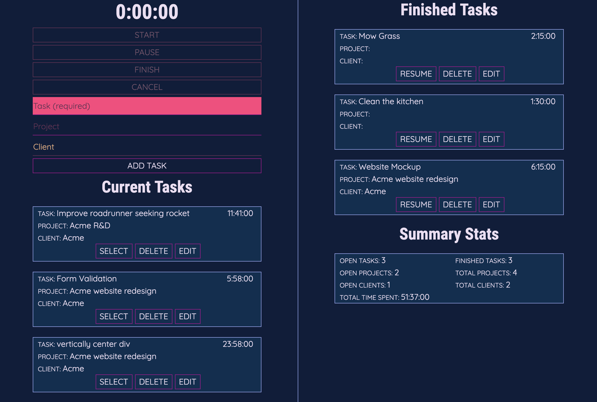

This was my first real foray into React outside of a a few tutorial projects and a simple weather app. It is a time tracking tool that lets users create, categorize, and track time on tasks. I added Redux, Firebase, and Charts.js to the mix because why not learn a few extra things along the way.

Timepiece has the basic features you'd expect like the ability to start, pause, finish and delete tasks; and allows users to maintain multiple finished and paused tasks and reactive them at any time.

Users can also view charts that break down the tasks, categories, and time spent in a few different ways.

I used Firebase for the database and for user authentication, which was a free and simple choice. If you'd like to take a look but don't want to sign up you can log in with demo@timepice.live. The password is password. This is a **read-only** user so you won't be able to do much other than look around with some mock data.

There are a few things I'd do differently if I were starting over, such as use a library such as Moment.js instead of handling all the timestamp stuff myself.
