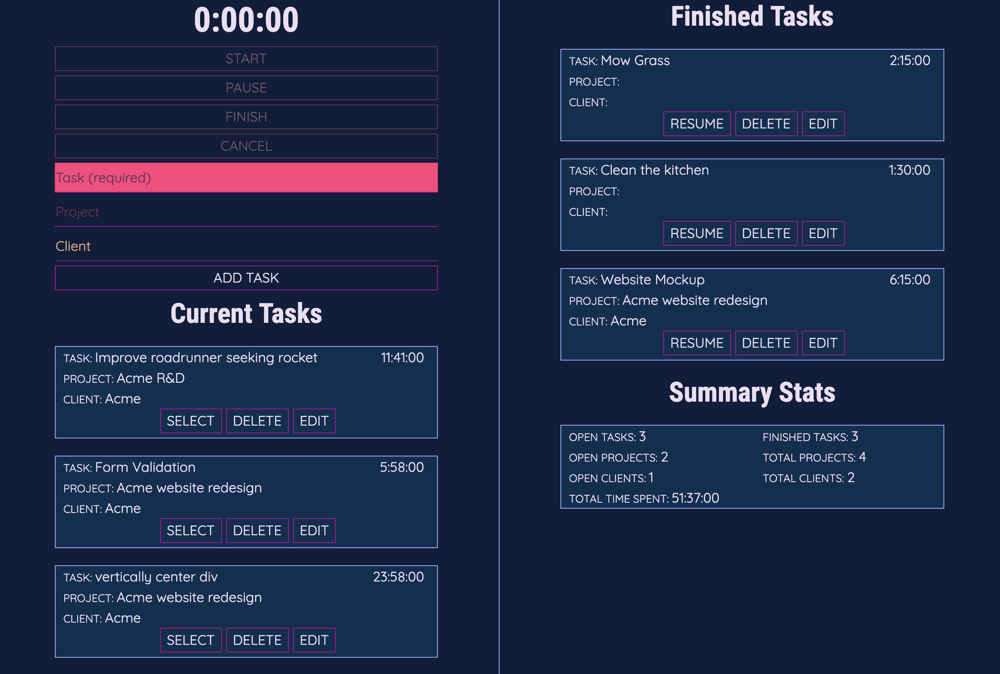

Timepiece is a time tracking tool that lets users create, categorize, and track time on tasks.

It has the basic features you'd expect like the ability to start, pause, finish and delete tasks, and allows users to maintain multiple finished and paused tasks and reactive them at any time.

I used Firebase for the database and for user authentication, which was a free and simple choice. If you'd like to take a look but don't want to sign up you can log in with demo@timepice.live. The password is password. This is a **read-only** user so you won't be able to do much other than look around with some mock data.

<em class="caption">From the main screen users can create and manage tasks.</em>

Users can edit the tasks they create. Including manually adding and removing time intervals. Changes the are automatically reflected in the summary stats and charts.

<em class="caption">The edit modal lets users change task, category, and project names and add/remove time intervals.</em>

Users can also view charts that break down the tasks, categories, and time spent in a few different ways.

<em class="caption">The charts screen provides visualizations and chart control parameters.</em>

I'd do differently if I were to do it all again, such as use a library such as Moment.js instead of handling all the timestamp stuff myself, but all in all this was a good learning project.
